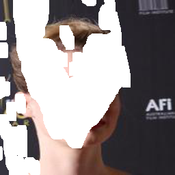

# Variable Hyperparameter Efficient Visual Transformer for Image Inpainting


<!-- ---------------------------------------------- -->
## Installation  

Clone this repo.

```
git clone https://github.com/jose13579/variable-hyperparameter-image-impainting.git
cd variable-hyperparameter-image-impainting/
```

We build our project based on Pytorch and Python libraries. To train and test our project, we suggest create a Conda environment from the provided YAML, e.g.

```
conda env create -f environment.yml 
conda activate vhii
```

Or use the Dockerfile to install conda and prerequisites, e.g.

```
docker build -t vhii-mage .
```

If you are having issues to install the environment, we suggest you follow the next steps:
- Remove the cupy from the environment.yml
- Create the conda env
- Manually install the cupy with the correct version:
``` 
conda install -c conda-force cupy==7.7.0
```
<!-- ---------------------------------------------- -->
## Dataset Preparation

We prepare the real and masks datasets. 

**Preparing Places365 Dataset.** The dataset can be downloaded from [here](http://places2.csail.mit.edu/). The training set has approximately 1.8 million images from 365 scene categories, where there are at most 5,000 images per category. We adopt the places365-Standard datasets (small images 256 * 256 version) to train and validate our proposed method. The dataset should be arranged in the same directory structure as

```
datasets
    ｜- places365
        |- data_256
            |- a
                |- airport_terminal
                    |- <image_id>.jpg
                    |- <image_id>.jpg
                |- airplane_cabin
                    |- <image_id>.jpg
                    |- <image_id>.jpg
                |- ...
            |- ...
        |- val_256
            |- <image_id>.jpg
            |- <image_id>.jpg
``` 

**Preparing CelebA Dataset.** The dataset can be downloaded from [here](https://drive.google.com/file/d/1jwjpPPVmNIKop_RMBBWwlP4zI2nBGTBd/view?usp=share_link). This dataset contains more than 200,000 large-scale facial celebrity images. We adopt 162,770 for training and 19,961 for test. The dataset should be arranged in the same directory structure as 

```
datasets
    ｜- celeba_dataset
        |- train
           |- <image_id>.jpg
           |- <image_id>.jpg
        |- val
           |- <image_id>.jpg
           |- <image_id>.jpg
        |- test
           |- <image_id>.jpg
           |- <image_id>.jpg
``` 

**Preparing Paris Street View (PSV) Dataset.** The dataset can be downloaded from [here](https://drive.google.com/file/d/1yuCLojjUPANZebwApgnJG99Fho7KspZL/view?usp=share_link). The training and test set includes 14,900 and 100 images, respectively. This dataset was collected from the street views of Paris, taking a large number of buildings, and structure information, such as windows and doors. The dataset should be arranged in the same directory structure as

```
datasets
    ｜- psv_dataset
        |- train
           |- <image_id>.jpg
           |- <image_id>.jpg
        |- test
           |- <image_id>.jpg
           |- <image_id>.jpg
``` 

**Preparing Mask Dataset.** The dataset can be downloaded from [here](https://www.dropbox.com/s/01dfayns9s0kevy/test_mask.zip?dl=0). This mask dataset contains 12,000 irregular masks grouped into six intervals according to the mask area on the total image size, where each interval has 2,000 masks. We employed three intervals (20-30%, 30-40%, and 40-50%) for test. The dataset should be arranged in the same directory structure as

```
datasets
    ｜- test_mask
        |- mask
            |- testing_mask_dataset
                |- 10-20
                    |- <mask_id>.png
                    |- <mask_id>.png                   
                |- 20-30
                    |- <mask_id>.png
                    |- <mask_id>.png
                |- ...
``` 
Or you can use the dataset grouped into directories per interval [here](https://drive.google.com/file/d/1vsdifS0OYtZOv2tCkaJBdmpMpi77oYyB/view?usp=sharing).

## Results and Models for VHII efficient
<!-- ---------------------------------------------- -->

### Places val
The trained model can be download: [places](https://drive.google.com/file/d/1wi6YDVWRUOH6ZOqscSfFwKQDXwxn5wY7/view?usp=share_link) 

|        Model     | Seed | Mask set | FID ↓  | LPIPS ↓ | PSNR ↑  | SSIM ↑ | Model Size (Mb) | FLOPS (G) | # Params (M) | Config
|-----------|------|----------|--------|---------|---------|--------|-----------------|-----------|--------------|--------
|  VHII efficient  |   0  |  20-30   | 1.1783 | 0.0649  | 26.4769 | 0.8922 |       71        |  150.272  |   17.552     | [config](https://drive.google.com/file/d/1mmIQ1UDYKvnhETZqGzpmU8GPPkyPjZAG/view?usp=share_link)
|  VHII efficient  |   0  |  30-40   | 2.3969 | 0.0995  | 24.1554 | 0.8368 |       71        |  150.272  |   17.552     | [config](https://drive.google.com/file/d/1q62abnjM5rYWUuWPtI4UlAgAqvIh7SHc/view?usp=share_link)
|  VHII efficient  |   0  |  40-50   | 4.6187 | 0.1404  | 22.3163 | 0.7751 |       71        |  150.272  |   17.552     | [config](https://drive.google.com/file/d/1txP8UmLEEic5p2MOmUMPEechUWGFES4G/view?usp=share_link)
|  VHII efficient  |  42  |  20-30   | 1.1806 | 0.0650  | 26.4727 | 0.8922 |       71        |  150.272  |   17.552     | [config](https://drive.google.com/file/d/1k35WKBFEE_DOR009ompS4ofl1MUcv939/view?usp=share_link)
|  VHII efficient  |  42  |  30-40   | 2.4146 | 0.0996  | 24.1472 | 0.8366 |       71        |  150.272  |   17.552     | [config](https://drive.google.com/file/d/1skFoechyXg_7p1IpXHDDvACw36pL9fYk/view?usp=share_link)
|  VHII efficient  |  42  |  40-50   | 4.6141 | 0.1405  | 22.3215 | 0.7750 |       71        |  150.272  |   17.552     | [config](https://drive.google.com/file/d/1sk-go4Mmsmgiw7GZDE5CzUPZK7nv0yxa/view?usp=share_link)
|  VHII efficient  |  123 |  20-30   | 1.1767 | 0.0650  | 26.4536 | 0.8920 |       71        |  150.272  |   17.552     | [config](https://drive.google.com/file/d/17DN3gU6gtPU8mzHqIPQ6NiWds7IvPVPp/view?usp=share_link)
|  VHII efficient  |  123 |  30-40   | 2.4125 | 0.0998  | 24.1337 | 0.8366 |       71        |  150.272  |   17.552     | [config](https://drive.google.com/file/d/1yz_34BM5sDXBCodcdMX822-Np1wi7w4W/view?usp=share_link)
|  VHII efficient  |  123 |  40-50   | 4.6877 | 0.1407  | 22.3123 | 0.7749 |       71        |  150.272  |   17.552     | [config](https://drive.google.com/file/d/1vciKKOYwmaKeG0pcG2SYGW3TpFOthM7E/view?usp=share_link)


### Celeba test
The trained model can be download: [celeba](https://drive.google.com/file/d/1_k0B8ItckZoVB0bPoRsmor7sL-eqQdZU/view?usp=share_link).

|        Model      | Seed | Mask set | FID ↓  | LPIPS ↓ | PSNR ↑  | SSIM ↑ | Model Size (Mb) | FLOPS (G) | # Params (M) | Config
|------------|------|----------|--------|---------|---------|--------|-----------------|-----------|--------------|--------
|  VHII efficient   |   0  |  20-30   | 0.7854 | 0.0330  | 31.3488 | 0.9415 |       71        |  150.272  |   17.552     | [config](https://drive.google.com/file/d/19jW9DHC05YkehYaelNMzguNlpMmWbqO2/view?usp=share_link)
|  VHII efficient   |   0  |  30-40   | 1.3521 | 0.0490  | 28.7055 | 0.9096 |       71        |  150.272  |   17.552     | [config](https://drive.google.com/file/d/1EyNjHuqsdPa42GMCDC2wc8y-FhdMtARd/view?usp=share_link)
|  VHII efficient   |   0  |  40-50   | 2.2800 | 0.0686  | 26.5571 | 0.8727 |       71        |  150.272  |   17.552     | [config](https://drive.google.com/file/d/1dhdAfHhTnkg9r2PeDsw04z2AFou6pb5x/view?usp=share_link)
|  VHII efficient   |  42  |  20-30   | 0.7714 | 0.0329  | 31.3497 | 0.9416 |       71        |  150.272  |   17.552     | [config](https://drive.google.com/file/d/1VokPjmqS1-_xhb5A2llD13mudxqJ4phk/view?usp=share_link)
|  VHII efficient   |  42  |  30-40   | 1.3552 | 0.0491  | 28.6867 | 0.9096 |       71        |  150.272  |   17.552     | [config](https://drive.google.com/file/d/1_3uE0b9W2IPF__8XpXk57B0Cy1D_3B83/view?usp=share_link)
|  VHII efficient   |  42  |  40-50   | 2.2400 | 0.0684  | 26.5921 | 0.8729 |       71        |  150.272  |   17.552     | [config](https://drive.google.com/file/d/1E2Szkb1VkZxGABjYZwm7snSztOlWpZJq/view?usp=share_link)
|  VHII efficient   |  123 |  20-30   | 0.7822 | 0.0330  | 31.3313 | 0.9415 |       71        |  150.272  |   17.552     | [config](https://drive.google.com/file/d/1y6Y4Uq2NIpdpozNfmgVxULBzEbZuwfqo/view?usp=share_link)
|  VHII efficient   |  123 |  30-40   | 1.3489 | 0.0491  | 28.7198 | 0.9097 |       71        |  150.272  |   17.552     | [config](https://drive.google.com/file/d/1HbaZxwXQ_zHtVIpnFkh3le_ucoDTEY6T/view?usp=share_link)
|  VHII efficient   |  123 |  40-50   | 2.2413 | 0.0685  | 26.5672 | 0.8728 |       71        |  150.272  |   17.552     | [config](https://drive.google.com/file/d/1Qzp0PvoFOykNew8Ukg2Dj8uNd-q8wGQq/view?usp=share_link)


### PSV test
The trained model can be download: [psv](https://drive.google.com/file/d/1WajIeVHIYBHN1dcEmJJynP0m2g60qAg1/view?usp=share_link).

|        Model      | Seed | Mask set | FID ↓  | LPIPS ↓ | PSNR ↑  | SSIM ↑ | Model Size (Mb) | FLOPS (G) | # Params (M) | Config
|-------------------|------|----------|---------|---------|---------|--------|-----------------|-----------|--------------|--------
|  VHII efficient   |   0  |  20-30   | 24.9343 | 0.0535  | 29.9719 | 0.9146 |       71        |  150.272  |   17.552     | [config](https://drive.google.com/file/d/1rVq94eokt9ofVdLNu3rl-igVDzfIOjGB/view?usp=share_link)
|  VHII efficient   |   0  |  30-40   | 35.9012 | 0.0787  | 27.6982 | 0.8719 |       71        |  150.272  |   17.552     | [config](https://drive.google.com/file/d/1TA5vmwGUNdOAdLMtS84tOepdPLvrhBeu/view?usp=share_link)
|  VHII efficient   |   0  |  40-50   | 46.5952 | 0.1118  | 25.7796 | 0.8209 |       71        |  150.272  |   17.552     | [config](https://drive.google.com/file/d/1Yc7nwdPv1Z_EYihf8r9fMiRJBc7wZa1V/view?usp=share_link)
|  VHII efficient   |  42  |  20-30   | 26.6362 | 0.0542  | 29.8541 | 0.9137 |       71        |  150.272  |   17.552     | [config](https://drive.google.com/file/d/11HbkNpAsEpxg2MRU-jgJmqYAhDES9t9y/view?usp=share_link)
|  VHII efficient   |  42  |  30-40   | 35.4199 | 0.0802  | 27.6240 | 0.8699 |       71        |  150.272  |   17.552     | [config](https://drive.google.com/file/d/15PvZQ1Sk97wYOR3U7mZtuJKIKur4JoZU/view?usp=share_link)
|  VHII efficient   |  42  |  40-50   | 47.6322 | 0.1138  | 25.7706 | 0.8187 |       71        |  150.272  |   17.552     | [config](https://drive.google.com/file/d/1oaclB-xZq15wi8A7N9IhMINSL9BnYmGD/view?usp=share_link)
|  VHII efficient   |  123 |  20-30   | 26.0129 | 0.0568  | 29.4361 | 0.9110 |       71        |  150.272  |   17.552     | [config](https://drive.google.com/file/d/1vtqmNulN_WIYqu5Wkp1h162WIy57g82B/view?usp=share_link)
|  VHII efficient   |  123 |  30-40   | 35.1132 | 0.0794  | 27.7138 | 0.8741 |       71        |  150.272  |   17.552     | [config](https://drive.google.com/file/d/1mVQJu-gnKa8mbhGyR7BnmqexwfprsrOz/view?usp=share_link)
|  VHII efficient   |  123 |  40-50   | 47.5585 | 0.1111  | 25.9231 | 0.8231 |       71        |  150.272  |   17.552     | [config](https://drive.google.com/file/d/1XCbeDZQXDM8Nqx56s26ZNxB8o5iHJ7iH/view?usp=share_link)


## Results and Models for VHII efficient

### Celeba test
The trained models can be download:
- [VHII efficient 256-128-64-32](https://drive.google.com/file/d/1aHdAEiAJwYEH7K1Jo3a4GjuJdRsaZas3/view?usp=share_link).
- [VHII efficient 128-64-32-16](https://drive.google.com/file/d/1QymaFdTno5q1gz6bsNk0vRHsKnVRzEDp/view?usp=share_link).
- [VHII efficient 64-32-16-8](https://drive.google.com/file/d/1Z1pkjBG2o4wzEHleVVO43lyvhUXBAb8V/view?usp=share_link).


| Model                         | Seed | Mask set | FID ↓  | LPIPS ↓ | PSNR ↑  | SSIM ↑ | Model Size (Mb) | FLOPS (G) | # Params (M) | Config
|-------------------------------|------|----------|--------|---------|---------|--------|-----------------|-----------|--------------|--------
|  VHII efficient 256-128-64-32 |   0  |  20-30   | 0.9393 | 0.0359  | 31.0091 | 0.9391 |       69        |  145.54   |   16.975    | [config](https://drive.google.com/file/d/10K9LtBD2grjFlP3FW9aWgfkyo_pIOBmw/view?usp=share_link)
|  VHII efficient 256-128-64-32 |   0  |  30-40   | 1.6504 | 0.0532  | 28.4032 | 0.9066 |       69        |  145.54   |   16.975    | [config](https://drive.google.com/file/d/1H_bfwOZGwlhYDXppABQz4wU_5pgnLZHC/view?usp=share_link)
|  VHII efficient 256-128-64-32 |   0  |  40-50   | 2.7938 | 0.0742  | 26.2939 | 0.8694 |       69        |  145.54   |   16.975    | [config](https://drive.google.com/file/d/1Lg7j8FAZ8Jmf0n8AQYwEhcXO51ovckN3/view?usp=share_link)
|  VHII efficient 128-64-32-16  |   0  |  20-30   | 1.3365 | 0.0418  | 30.2689 | 0.9323 |       21        |  46.412   |    4.868    | [config](https://drive.google.com/file/d/1Lx5RVMBX-pC5m4H7BEbyDyB-puVGfUNK/view?usp=share_link)
|  VHII efficient 128-64-32-16  |   0  |  30-40   | 2.0768 | 0.0620  | 27.7036 | 0.8971 |       21        |  46.412   |    4.868    | [config](https://drive.google.com/file/d/16kaKpy2KFS11lTFiEA2kMqur_fQBOj4m/view?usp=share_link)
|  VHII efficient 128-64-32-16  |   0  |  40-50   | 4.1076 | 0.0861  | 25.6279 | 0.8572 |       21        |  46.412   |    4.868    | [config](https://drive.google.com/file/d/1kB0AMISAGLCD0w9SElURbKfZyY0irM1f/view?usp=share_link)
|  VHII efficient 64-32-16-8    |   0  |  20-30   | 2.0768 | 0.0509  | 29.4559 | 0.9208 |       7.4       |   20.12   |    1.655    | [config](https://drive.google.com/file/d/1hqK0DHu1KRL8mbUB3sROgn-FQsPTLyc7/view?usp=share_link)
|  VHII efficient 64-32-16-8    |   0  |  30-40   | 3.837  | 0.0751  | 26.9152 | 0.8860 |       7.4       |   20.12   |    1.655    | [config](https://drive.google.com/file/d/1EBoW5ALYIalt9gHXn2k7om1mPpXpdjgJ/view?usp=share_link)
|  VHII efficient 64-32-16-8    |   0  |  40-50   | 6.7535 | 0.1033  | 24.8644 | 0.8432 |       7.4       |   20.12   |    1.655    | [config](https://drive.google.com/file/d/1nop2CHLsmyzHJ3pJkjTo81aOQdQblkRc/view?usp=share_link)

<!-- ---------------------------------------------- -->

## Training New Models
Once the dataset is prepared, new models can be trained with the following commands:  

```
bash run_train.sh --train_config_file
```
For example:

```
bash run_train.sh configs/psv_proposal_efficient_128_64_32_16_channels.json
```

<!-- ---------------------------------------------- -->

## Testing
To test the models 

1. Download the trained models, and save they in ```trained_models/```. 

2. Run the test bash file to evaluate/test the trained model. 

```
bash run_test_dataset.sh --model_name --model_path --seed --gt_dataset_path --mask_dataset_path --output_dataset_path 
```

For example:
```
bash run_test_dataset.sh "VHII_efficient" "trained_models/celeba/celeba_VHII_efficient/gen_00050.pth" 0 "/data/celeba/celeba_dataset/test/" "/data/pconv/test_mask/20-30/" "test_output_datasets/trained_celeba_VHII_efficient_seed_0"
```
The outputs inpainted images are saved at ```test_output_datasets/```.  

<!-- ---------------------------------------------- -->

## Metrics

To measure the quantitative results:
```
cd metrics
bash run_metrics.sh --gt_dataset_path --output_dataset_path
```

For example:

```
bash run_metrics.sh "/data/celeba/celeba_dataset/test/" "/config/variable-hyperparameter-image-impainting/test_output_datasets/trained_celeba_VHII_efficient_seed_0"
```

<!-- ---------------------------------------------- -->

## Image Demo

To inference a single image like this:
```
bash run_test_image.sh --model_name --model_path --input_path --mask_path --output_path --output_name
```

For example:

```
bash run_test_image.sh "VHII_efficient" trained_models/celeba/celeba_VHII_efficient/gen_00050.pth "examples/img/100_000100_gt.png" "examples/mask/100_000100_mask.png" "examples/output" "100_000100_output"
```

## RECOMENDATION
If you are having problems to test our model (e.g celeba), I suggest you follow the next steps:

- Use the images from examples/ directory, there you can find the examples that you can use to test the proposed model 
- Download the celeba model [here](https://drive.google.com/file/d/1_k0B8ItckZoVB0bPoRsmor7sL-eqQdZU/view) and put it inside the directory "trained_models/celeba/celeba_VHII_efficient"
- Create the docker image
```
docker build -t vhii-mage .
```
- Create a repository
```
nvidia-docker run --userns=host -it --rm --name vhii-repository -v /work/data/:/data -v /work/code/:/code vhii-mage bash
```
- Inside the docker repository, you can run the test command
```
bash run_test_image.sh "VHII_efficient" trained_models/celeba/celeba_VHII_efficient/best_model_celeba.pth "examples/img/100_000100_gt.png" "examples/mask/100_000100_mask.png" "examples/output" "100_000100_output"
```

<!-- ---------------------------------------------- -->

## Visualization
<p> &nbsp;&nbsp;&nbsp;&nbsp; </p>

<p> &nbsp;&nbsp;&nbsp;&nbsp; </p>

<!-- ---------------------------------------------- -->

## Citing VHII efficient

```BibTeX
@article{Campana2023_Inpainting,
  author=(J.L.F. Campana and L.G.L. Decker and M.R. Souza and H.A. Maia and H. Pedrini}
  title={Variable-Hyperparameter Visual Transformer for Efficient Image Inpainting},
  journal={Computers \& Graphics},
  year={2023}
}
```

<!-- ---------------------------------------------- -->

## Contact
If you have any questions or suggestions about this paper, feel free to contact me (j209820@dac.unicamp.br).
